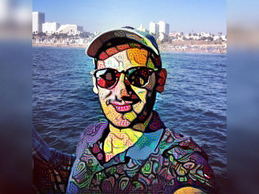

<h1>Introduction/ Problem statement:</h1>

Style transfer has been around for last two-three years now. Most of the work is being done on style transfer to entire image. In Recent times there has been considerable amount of work going in to transfer multiple styles to certain parts of the image. We are trying to implement instance aware targeted style transfer, in which different styles can be transferred to different objects of the image as per the requirement. For example, if an image contains a car and a person we can transfer one style to the car and other style to person. It can also transfer different styles to different instances of the same object.

# Our Approach:

We are doing it in two phases:

Instance aware semantic segmentation.
Style transfer.

## Instance aware semantic segmentation:
explain the procedure with architecture(Anshul/Akshay)
Here, for semantic segmentation we are using a Mask RCNN. 

## Style Transfer:
We implement style transfer as an optimization problem as described in Gatys et al. [1]. Given a content image c, and a style image s we start with any random image and try to minimize the overall loss( content and style loss) given by the formula:
x∗=argminx(αLcontent(c,x)+βLstyle(s,x))
L=αLc+βLs

Output considering both conv2_2 and conv4_2 layers for content loss:

alpha = content loss weightage
beta = style loss weightage
Total loss has two components:

content loss (Lcontent):  Content loss measures how much the feature map of the generated image differs from the feature map of the source image. Conv4_2 layer was used in Gatys et al for evaluating the content loss and conv2_2 was used in johnson et al for content loss. Initial layers represent the lower level content and style features if image and deeper layers represent higher level features. Higher or deeper layers represent or maintain the spatial structure of the image but may not necessarily represent the exact size and shape of the image. Based on the runs we had we observed that using both layers for evaluation of content loss was giving us more aesthetically pleasing results.
content loss = Lc=(1/2rootM * root N) ∑i,j(Fij−Pij)2

Style Loss(Lstyle):  To capture style of an image we use gram matrix.  Gram matrix G represents the correlations between the responses of each filter. The Gram matrix is an approximation to the covariance matrix -- we want the activation statistics of our generated image to match the activation statistics of our style image, and matching the (approximate) covariance is one way to do that.
Gℓij=∑kFikFjk

Style loss at a particular layer can be calculated using the below formula:
Eℓ=(1/4N2M2)∑i,j(Gij−Aij)2
Usually we use more than one layer to capture the style loss. There we do the summation over losses of all the layers we use with weights being given to each layer to specify the importance of that particular layer. Therefore the style loss would be:
Ls=∑ℓ∈wℓEℓ

We are using pretrained VGG-19 model for style transfer. Conv2_2 and conv4_2 are used for content loss. relu1_1, relu2_1, relu3_1, relu4_1 and relu5_1 are used for evaluation of style loss. These layers are configurable which can be changed as per the requirement.
put some results comparing layers.
explain the procedure with approach(Shashi)
compare adam and lbfgs
compare different layers

Initially we had planned to do the style transfer to the entire image, followed by instance aware semantic segmentation which gave us the masks for different objects in the image. Then using these masks and user input we planned to superimpose the style onto original image accordingly. But this approach was not optimal as we were transferring many styles over the entire image which was redundant.  So we came up with a different approach for achieving targeted style transfer. Now, we are first doing the instance aware semantic segmentation part, which gives us the bounding boxes as well as the masks for each instance of every object in the image. After that, we take the input from the user as to which instance of which object he/she wants the style to be transferred on. The user can select multiple object instances and for the selected objects, we generate the masks as black and white images, with the white part denoting the mask for that object instance. Once this is done, we transfer the style onto the various user specified objects, and finally we get the style transferred image with the style transfer on the selected objects accordingly.

# Results:

# References:

