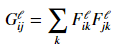
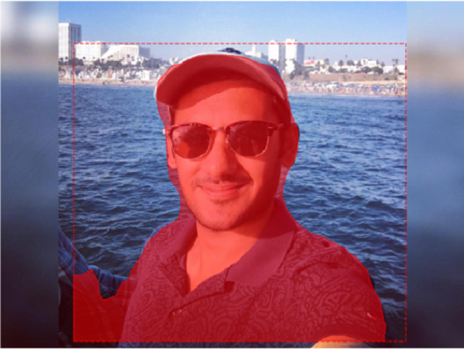

<h1 align="center"><b>Targeted Style Transfer</b></h1>

<h4 align="center">Anshul Rawat, Akshay Kumar Shreekanth, Shashi Kiran Yellappa</h4>

# **Introduction/ Problem statement**

Style transfer has been around for last two-three years now. Most of the work is being done on style transfer to entire image. In Recent times there has been considerable amount of work going in to transfer multiple styles to certain parts of the image. We are trying to implement instance aware targeted style transfer, in which different styles can be transferred to different objects of the image as per the requirement. For example, if an image contains a car and a person we can transfer one style to the car and other style to person. It can also transfer different styles to different instances of the same object.

# **Our Approach**

We are doing it in two phases:

1) Instance aware semantic segmentation.

2) Style transfer.

## **Instance aware semantic segmentation:**
Here, for semantic segmentation we are using an implementation of Mask-RCNN, based on Feature Pyramid Networks(FPN) and using a ResNet101 network as the backbone. For training, we used the MS COCO dataset. We pass an image as input and the network outputs bounding boxes and segmentation masks for each instance for every object in a image. 
Till now CNNs have effectively been used to identify objects and put bounding boxes around them. We can go one step further and locate exact pixels of bounding boxes which belong to the object. In order to accomplish this, we have leveraged the Mask RCNN network.
  

In Mask R-CNN, a Fully Convolutional Network (FCN) is added on top of the CNN features of Faster R-CNN to generate a mask (segmentation output). Notice how this is in parallel to the classification and bounding box regression network of Faster R-CNN. This additional network outputs a binary mask that says whether or not a given pixel is part of the object. The inputs and outputs to this branch are as follows : 

### **Inputs** - CNN Feature Map.
### **Outputs** - Matrix with 1’s for all the pixel locations which belong to the object & 0’s elsewhere.

### **ROI Align** - Aligning the ROI to be more accurate:
In the original Faster RCNN, the feature maps selected by the ROI Pool layer is slightly misaligned from the regions of the original image. As we need pixel level perfection for image segmentation, this will lead to inaccuracies.
We can solve this problem by adjusting the  ROI Pool  layer to be more precisely aligned by using a method known as ROI Align.

### **Feature Pyramid Network(FPN)**
Additionally, the Mask-RCNN also leverages the FPN to be able to detect objects in an image at different scales. This is quite useful in real world images, when there could exist instances of the the same object in an image, but at different scales.
 

## Example images with objects detected by semantic segmentation

 

 
 

## **Style Transfer:**
We implement style transfer as an optimization problem as described in Gatys et al. Given a content image c, and a style image s we start with any random image and try to minimize the overall loss (content and style loss) given by the formula:

alpha = content loss weightage
 
beta = style loss weightage

Total loss has two components:

**Content Loss:**  Content loss measures how much the feature map of the generated image differs from the feature map of the source image. Conv4_2 layer was used in Gatys et al for evaluating the content loss and conv2_2 was used in johnson et al for content loss. Initial layers represent the lower level content features of an image and deeper layers represent higher level features. Higher or deeper layers represent or maintain the spatial structure of the image but may not necessarily represent the exact size and shape of the image. Based on the runs we had we observed that using both layers for evaluation of content loss was giving us more aesthetically pleasing results. Each row of F or P represents the vectorized activations of a particular filter, convolved over all positions of the image.

M = Height * Width of the image
 
N = Depth (number of channels) of the image

**Style Loss:**  To capture style of an image we use gram matrix.  Gram matrix G represents the correlations between the responses of each filter. The Gram matrix is an approximation to the covariance matrix -- we want the activation statistics of our generated image to match the activation statistics of our style image, and matching the (approximate) covariance is one way to do that.

Style loss at a particular layer can be calculated using the below formula:

Usually we use more than one layer to capture the style loss. There we do the summation over losses of all the layers we use with weights being given to each layer to specify the importance of that particular layer. Therefore the style loss would be:

We are using pretrained VGG-19 model for style transfer. Conv2_2 and conv4_2 are used for content loss. relu1_1, relu2_1, relu3_1, relu4_1 and relu5_1 are used for evaluation of style loss. These layers are configurable which can be changed as per the requirement.
put some results comparing layers.

## **VGG-19 model**

We have used L-BFGS optimizer as the default optimizer in our network for style transfer because it converges faster compared to Adam. But the drawback of L-BFGS is that it is computationally heavier compared to Adam. So there is an option to use Adam optimizer if the computational resources are not abundant. Below graph roughly summarizes the performance of these optimizers:

## **Example output of style transfer on an image**

Initially we had planned to do the style transfer to the entire image, followed by instance aware semantic segmentation which gave us the masks for different objects in the image. Then using these masks and user input we planned to superimpose the style onto original image accordingly. But this approach was not optimal as we were transferring many styles over the entire image which was redundant.  So we came up with a different approach for achieving targeted style transfer. Now, we are first doing the instance aware semantic segmentation part, which gives us the bounding boxes as well as the masks for each instance of every object in the image. After that, we take the input from the user as to which instance of which object he/she wants the style to be transferred on. The user can select multiple object instances and for the selected objects, we generate the masks as black and white images, with the white part denoting the mask for that object instance. Once this is done, we transfer the style onto the various user specified objects, and finally we get the style transferred image with the style transfer on the selected objects accordingly.
 
# **Results**
In this section we present various results we got from our network.

## **Content image**

## **Style image**

## **Output from semantic segmentation**

## **Mask image generated using output of semantic segmentation**

The following results are obtained for 1000 iterations and a ratio of 1:40 for content & style weights.

## **Output when only conv4_2 is used**

## **Output when only conv2_2 is used**

## **Output when both conv2_2 and conv4_2 are taken together**

 

Here, we also show an example of multi style transfer to different objects in an image.

## **Content image**

## **style images**

## **Result image**

# **References**

[1] Leon A. Gatys, Alexander S. Ecker and Matthias Bethge. "A Neural Algorithm of Artistic Style", arXiv:1508.06576v2, 2 Sep 2015.

[2] Justin Johnson, Alexandre Alahi and Li Fei-Fei. "Perceptual Losses for Real-Time Style Transfer and Super-Resolution",      arXiv:1603.08155v1, 27 Mar 2016.

[3] Carlos Castillo, Soham De, Xintong Han, Bharat Singh, Abhay Kumar Yadav and Tom Goldstein. "Son of Zorn’s Lemma: Targeted Style Transfer Using Instance-Aware Semantic Segmentation", International Conference on Acoustics, Speech and Signal Processing, 2017.

[4] Tsung-Yi Lin, Piotr Dollar, Ross Girshick1, Kaiming He1, Bharath Hariharan1 and Serge Belongie. "Feature Pyramid Networks for Object Detection", arXiv:1612.03144v2, 19 Apr 2017.

[5] Kaiming He, Georgia Gkioxari, Piotr Dollar and Ross Girshick. "Mask R-CNN", arXiv:1703.06870v2, 5 Apr 2017.

